# JobTrace

## Description

JobTrace is a full-stack web application designed to help job seekers centralize, organize and monitor their job applications.

Instead of managing multiple spreadsheets, emails and documents, JobTrace provides a single workspace where users can manage applications, companies, contacts and documents while keeping track of interviews, follow-ups and personal objectives.

The project was developed as part of the French RNCP Level 6 "Concepteur Développeur d'Applications" certification and focuses on building a modern, secure and maintainable web application using current development practices.

## Objectives

- Centralize every job application in a single dashboard.
- Simplify application tracking and follow-up management.
- Manage companies, recruiters and professional contacts.
- Store documents related to applications.
- Visualize application progress and personal statistics.
- Apply modern web development, testing and security practices.

## Tech Stack


## File Description

| **FILE**                  | **DESCRIPTION**                                                                                                     |
| :-----------------------: | ------------------------------------------------------------------------------------------------------------------- |
| `assets/`                  | Contains the resources required for the repository.                                                                 |
| `backend/`                 | Contains the Express REST API, authentication, business logic, and database access.                                 |
| `frontend/`                | Contains the React single-page application and its user interface.                                                  |
| `docs/`                    | Contains the project report submitted for the RNCP certification, along with its diagrams and supporting resources. |
| `.env.example`            | Provides an example of the environment variables required to configure the project.                                 |
| `docker-compose.prod.yml` | Defines the Docker services and configuration used for the production environment.                                  |
| `docker-compose.yml`      | Defines the Docker services required to run the complete project locally.                                           |
| `.gitignore`              | Specifies files and folders to be ignored by Git.                                                                   |
| `README.md`               | The README file you are currently reading 😉.                                                                       |

## Installation & Usage

### Installation

1. Clone this repository:
    - Open your preferred Terminal.
    - Navigate to the directory where you want to clone the repository.
    - Run the following command:

```
git clone https://github.com/fchavonet/full_stack-jobtrace.git
```

2. Open the cloned repository.

3. Start the complete application:

```
docker compose up --build
```

### Usage

1. Open your browser and navigate to:

```
http://localhost:3000
```

You can also test the project online by clicking [here](https://www.jobtrace.fr/).

> To better understand the project’s design and development process, you can consult the PDF available in the `docs/` directory at the root of the repository. It contains the project report submitted for the RNCP certification, along with the associated diagrams and supporting resources (written in French). For more detailed technical information, refer to the dedicated README files located in the `frontend/` and `backend/` directories.

<p align="center">
    <picture>
        <source media="(prefers-color-scheme: light)" srcset="./assets/images/screenshots/dashboard-light.webp">
        <source media="(prefers-color-scheme: dark)" srcset="./assets/images/screenshots/dashboard-dark.webp">
        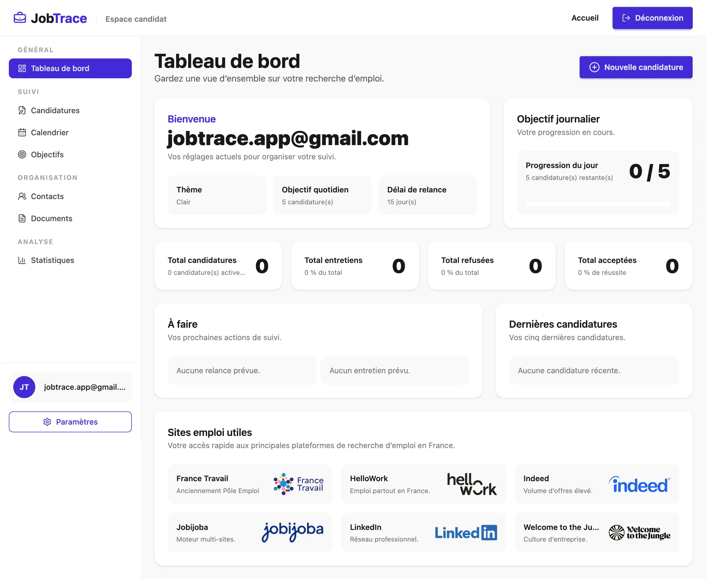
    </picture>
</p>

<p align="center">
    <picture>
        <source media="(prefers-color-scheme: light)" srcset="./assets/images/screenshots/applications-light.webp">
        <source media="(prefers-color-scheme: dark)" srcset="./assets/images/screenshots/applications-dark.webp">
        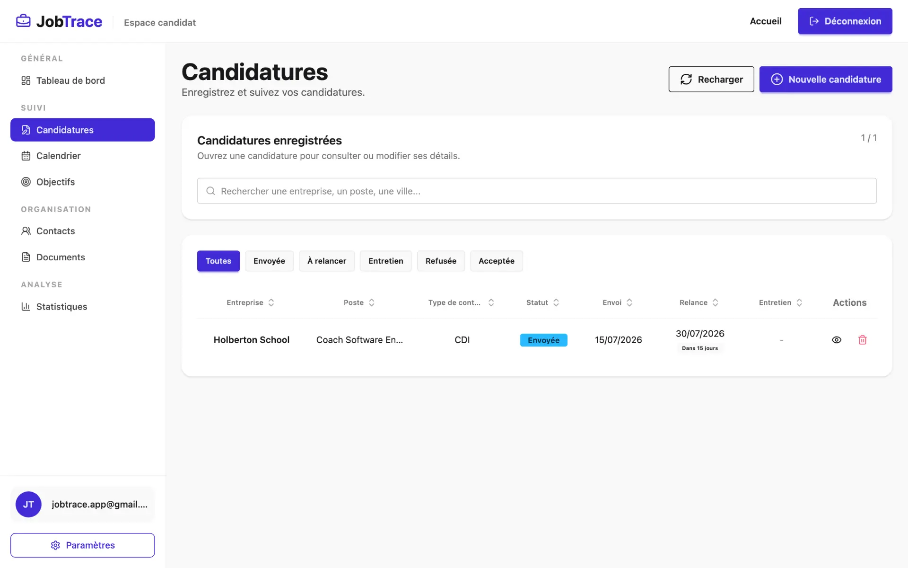
    </picture>
</p>

<p align="center">
    <picture>
        <source media="(prefers-color-scheme: light)" srcset="./assets/images/screenshots/application_form-light.webp">
        <source media="(prefers-color-scheme: dark)" srcset="./assets/images/screenshots/application_form-dark.webp">
        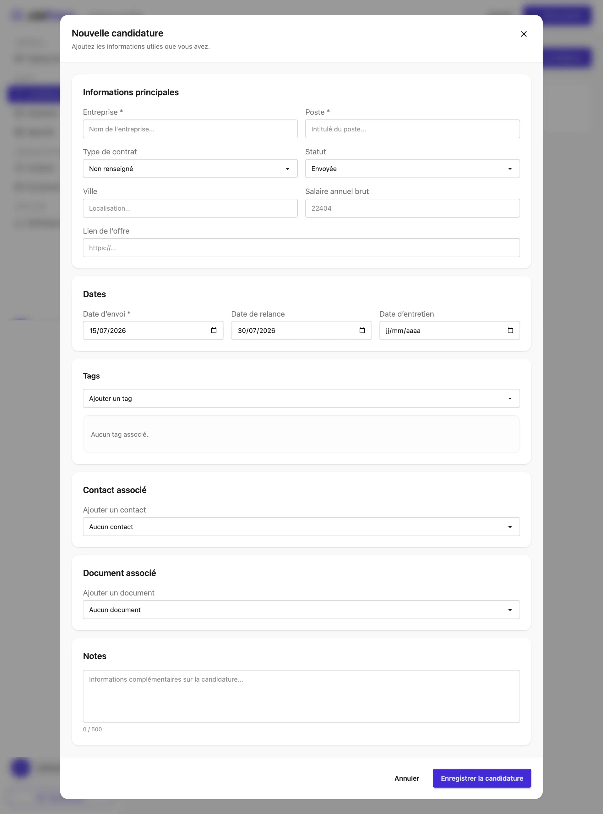
    </picture>
</p>

<p align="center">
    <picture>
        <source media="(prefers-color-scheme: light)" srcset="./assets/images/screenshots/calendar-light.webp">
        <source media="(prefers-color-scheme: dark)" srcset="./assets/images/screenshots/calendar-dark.webp">
        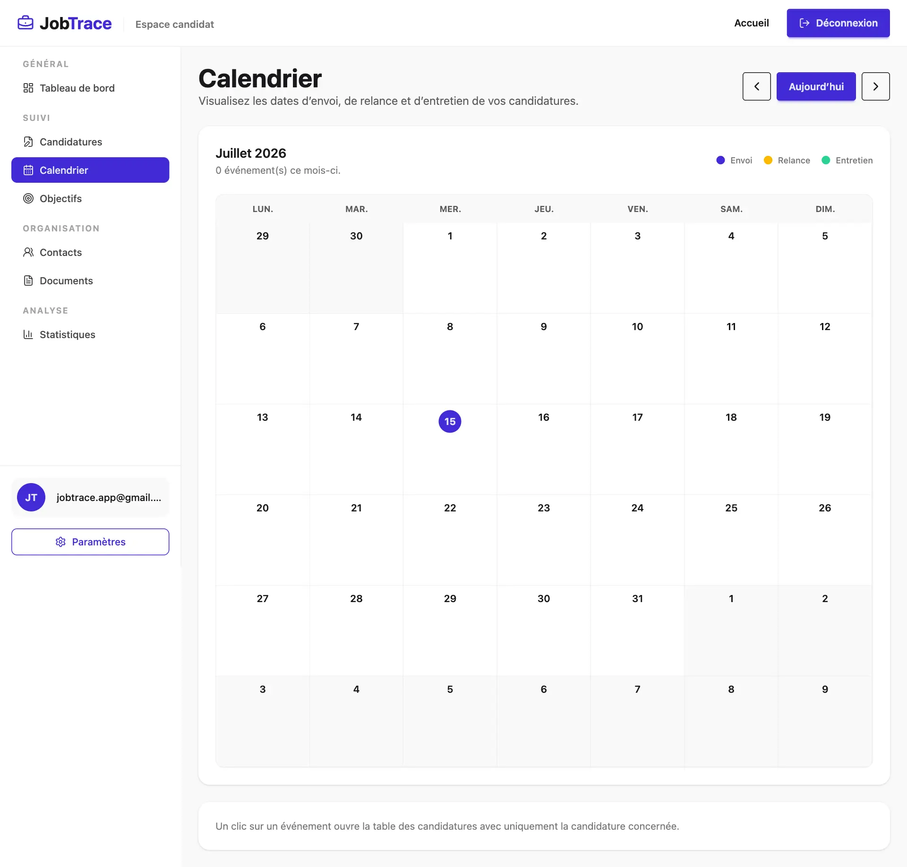
    </picture>
</p>

<p align="center">
    <picture>
        <source media="(prefers-color-scheme: light)" srcset="./assets/images/screenshots/achievements-light.webp">
        <source media="(prefers-color-scheme: dark)" srcset="./assets/images/screenshots/achievements-dark.webp">
        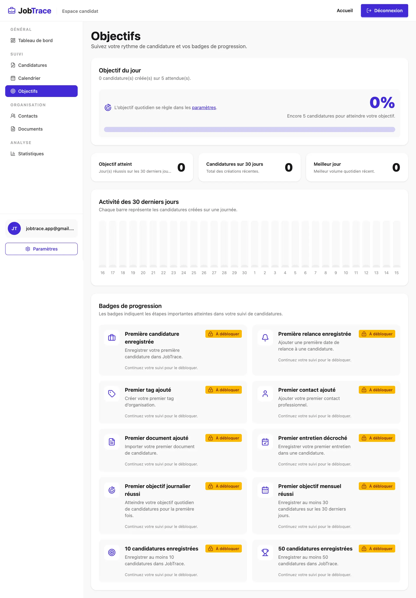
    </picture>
</p>

<p align="center">
    <picture>
        <source media="(prefers-color-scheme: light)" srcset="./assets/images/screenshots/contacts-light.webp">
        <source media="(prefers-color-scheme: dark)" srcset="./assets/images/screenshots/contacts-dark.webp">
        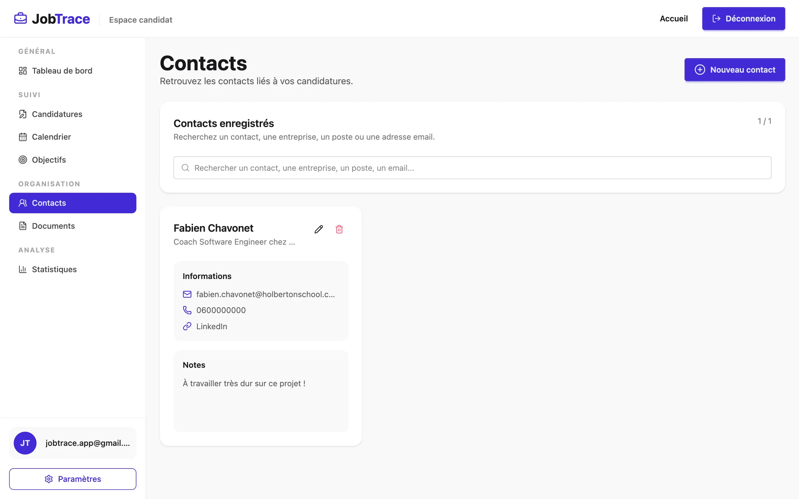
    </picture>
</p>

<p align="center">
    <picture>
        <source media="(prefers-color-scheme: light)" srcset="./assets/images/screenshots/documents-light.webp">
        <source media="(prefers-color-scheme: dark)" srcset="./assets/images/screenshots/documents-dark.webp">
        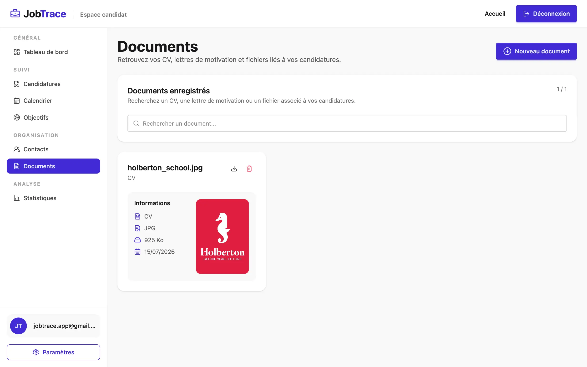
    </picture>
</p>

<p align="center">
    <picture>
        <source media="(prefers-color-scheme: light)" srcset="./assets/images/screenshots/statistics-light.webp">
        <source media="(prefers-color-scheme: dark)" srcset="./assets/images/screenshots/statistics-dark.webp">
        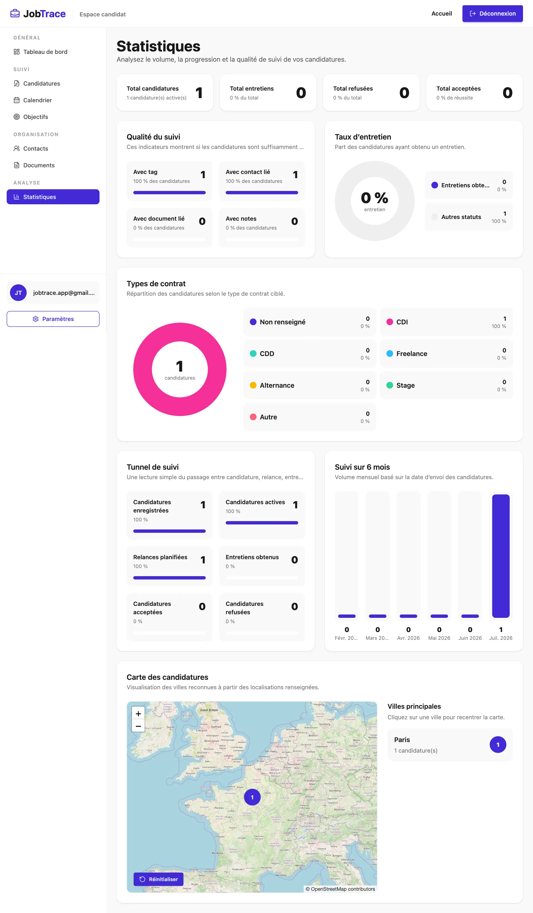
    </picture>
</p>

<p align="center">
    <picture>
        <source media="(prefers-color-scheme: light)" srcset="./assets/images/screenshots/settings-light.webp">
        <source media="(prefers-color-scheme: dark)" srcset="./assets/images/screenshots/settings-dark.webp">
        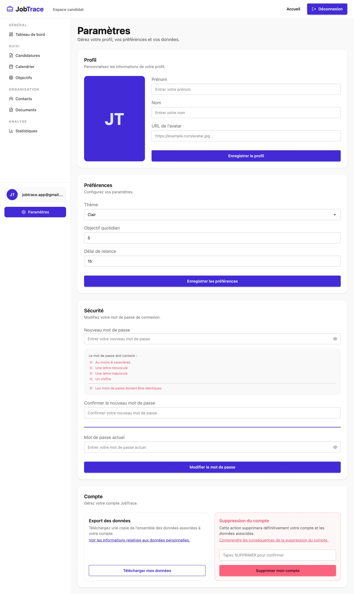
    </picture>
</p>

<table align="center">
    <tr>
        <th align="center" style="text-align: center;">Desktop view</th>
        <th align="center" style="text-align: center;">Tablet view</th>
        <th align="center" style="text-align: center;">Mobile view</th>
    </tr>
    <tr valign="top">
        <td align="center">
            <picture>
                <source media="(prefers-color-scheme: light)" srcset="./assets/images/screenshots/homepage-desktop-light.webp">
                <source media="(prefers-color-scheme: dark)" srcset="./assets/images/screenshots/homepage-desktop-dark.webp">
                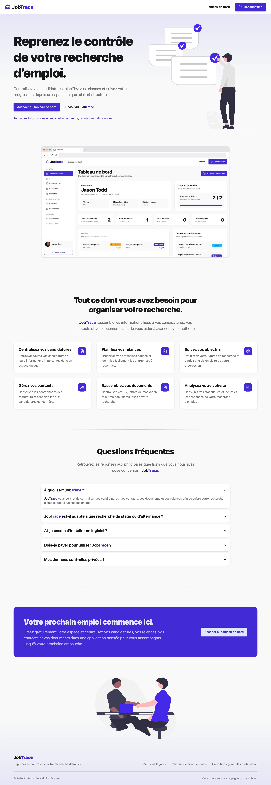
            </picture>
        </td>
        <td align="center">
            <picture>
                <source media="(prefers-color-scheme: light)" srcset="./assets/images/screenshots/homepage-tablet-light.webp">
                <source media="(prefers-color-scheme: dark)" srcset="./assets/images/screenshots/homepage-tablet-dark.webp">
                
            </picture>
        </td>
        <td align="center">
            <picture>
                <source media="(prefers-color-scheme: light)" srcset="./assets/images/screenshots/homepage-mobile-light.webp">
                <source media="(prefers-color-scheme: dark)" srcset="./assets/images/screenshots/homepage-mobile-dark.webp">
                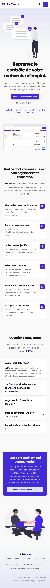
            </picture>
        </td>
    </tr>
</table>

## What's Next?

- Strengthen application security.
- Add city autocomplete using an external API.
- Improve the user interface and overall user experience.
- Complete the CI/CD pipeline with automated deployment to the VPS.

## Thanks

- I would like to thank all those who participated or helped to carry out this project.
- A big thank you to my friends Pierre and Yoann, always available to test and provide feedback on my projects.

## Author(s)

**Fabien CHAVONET**
- GitHub: [@fchavonet](https://github.com/fchavonet)
- LinkedIn: [Fabien Chavonet](https://www.linkedin.com/in/fchavonet/)
