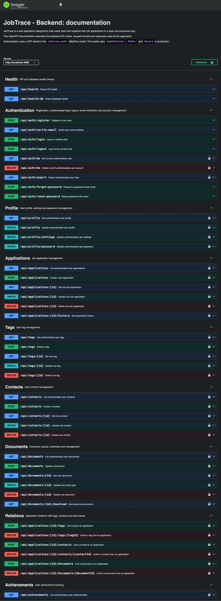
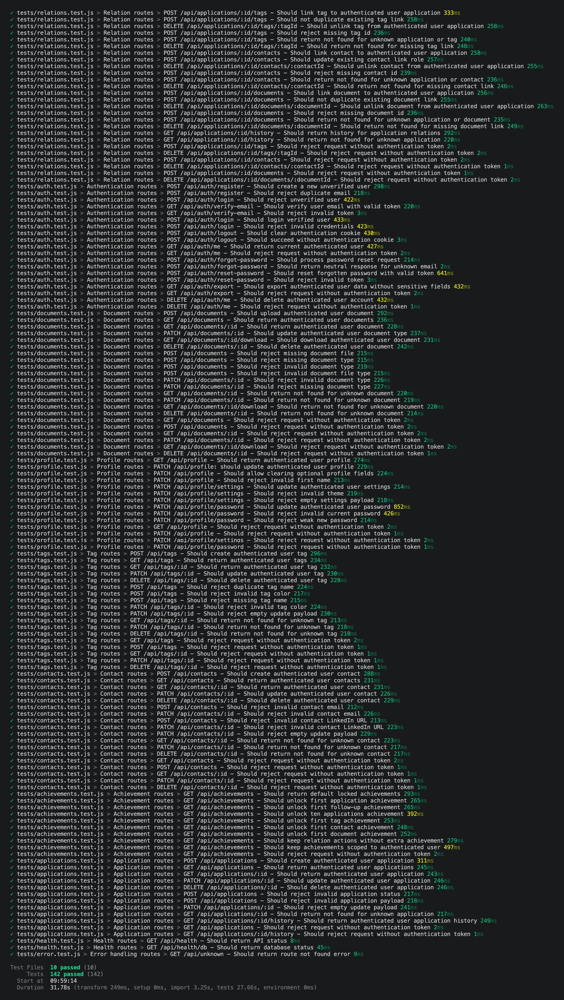
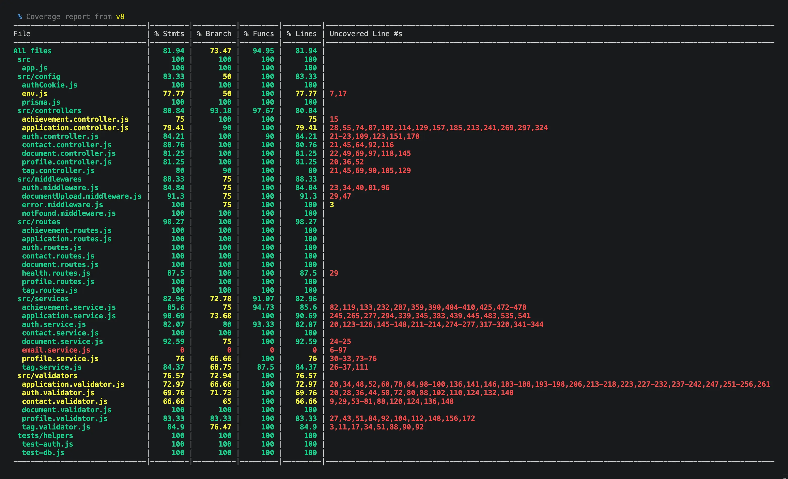

# JobTrace - Backend

## Description

The JobTrace backend is a REST API responsible for the application’s authentication, business logic, data validation and database access.

Built with Node.js and Express, it communicates with a PostgreSQL database through Prisma ORM. It provides the endpoints required to manage user accounts, profiles, applications, tags, contacts, documents and achievements.

Authentication is based on JSON Web Tokens stored in secure HTTP cookies. The API also includes email verification, password reset, user data export, automated tests and interactive documentation generated with Swagger UI.

## Objectives

- Provide a structured REST API for the JobTrace application.
- Secure user authentication and access to personal resources.
- Manage applications, tags, contacts, documents and achievements.
- Store and retrieve application data using PostgreSQL and Prisma ORM.
- Validate incoming data and return consistent HTTP responses.
- Document the available API routes with OpenAPI and Swagger UI.
- Maintain code quality through linting and automated tests.

## Tech Stack


## File Description

| **FILE**               | **DESCRIPTION**                                                                     |
| :--------------------: | ----------------------------------------------------------------------------------- |
| `prisma/`              | Contains the Prisma schema, database migrations and development seed.               |
| `src/`                 | Contains the source code of the REST API.                                           |
| `tests/`               | Contains the backend automated tests and their supporting utilities.                |
| `uploads/`             | Stores the documents uploaded by users during local development.                    |
| `docs/`                | Contains the OpenAPI specification used to generate the API documentation.          |
| `.env.example`         | Provides an example of the environment variables required to configure the backend. |
| `package.json`         | Defines the project metadata, dependencies and available npm scripts.               |
| `package-lock.json`    | Locks the exact versions of the installed npm dependencies.                         |
| `eslint.config.js`     | Configures ESLint rules to maintain code quality and consistency.                   |
| `docker-entrypoint.sh` | Runs the required initialization commands when the Docker container starts.         |
| `Dockerfile`           | Defines the Docker image used to run the backend application.                       |
| `.gitignore`           | Specifies files and folders to be ignored by Git.                                   |
| `README.md`            | The README file you are currently reading 😉.                                       |

## Installation & Usage

### Installation

1. Clone this repository:
    - Open your preferred Terminal.
    - Navigate to the directory where you want to clone the repository.
    - Run the following command:

```
git clone https://github.com/fchavonet/full_stack-jobtrace.git
```

2. Open the cloned repository.

3. Open the backend directory:

```
cd backend
```

4. Install the dependencies:

```
npm install
```

5. Create the local environment file:

```
cp .env.example .env
```

6. Configure the required environment variables inside the `.env` file.

7. Open a second Terminal, navigate to the root directory of the project, and start the PostgreSQL database:

```
docker compose up database -d
```

8. Return to the first Terminal, which should still be located in the `backend/` directory, and generate the Prisma client:

```
npm run prisma:generate
```

9. Apply the database migrations:

```
npm run prisma:migrate
```

10. Populate the development database with sample data:

```
npm run prisma:seed
```

11. Start the backend development server:

```
npm run dev
```

### Usage

1. Once the backend server is running, the following endpoints are available:

- REST API:

```
http://localhost:4000/api
```

- Application health check:

```
http://localhost:4000/api/health
```

_Expected response:_

```json
{
  "success": true,
  "message": "API is running.",
  "data": {
    "status": "ok"
  }
}
```

- Database health check:

```
http://localhost:4000/api/health/db
```

_Expected response:_

```json
{
  "success": true,
  "message": "Database connection is working.",
  "data": {
    "status": "ok"
  }
}
```

- Swagger UI documentation:

```
http://localhost:4000/api/doc
```

2. To inspect the database using Prisma Studio:

```
npm run prisma:studio
```

3. To run the automated tests:

```
npm run test
```

4. Additional useful commands:

- Check the current migration status: `npm run prisma:status`.
- Reset the development database: `npm run prisma:reset`.

<br>

- Run ESLint: `npm run lint`.
- Automatically fix supported linting issues: `npm run fix`.

<br>

- Run the test suite with detailed output: `npm run test:verbose`.
- Generate the test coverage report: `npm run test:coverage`.

5. For a detailed understanding of the API behavior, available routes, expected responses and tested scenarios, refer to the [manual API testing documentation](./docs/manual-tests.md).

6. The following screenshot shows the interactive API documentation generated with Swagger UI.



7. The following screenshots show the results of the automated backend tests and the generated code coverage report.





> For a clearer and more detailed overview of the automated test suite, covered features and latest results, refer to [the backend automated test summary](./docs/automated-tests.md).

## What's Next?

- Strengthen API security with additional HTTP security headers.
- Add rate limiting to sensitive endpoints.
- Improve validation and error handling.
- Continue expanding automated test coverage.
- Complete the CI/CD pipeline with automated deployment to the VPS.

## Thanks

- I would like to thank all those who participated or helped to carry out this project.
- A big thank you to my friends Pierre and Yoann, always available to test and provide feedback on my projects.

## Author(s)

**Fabien CHAVONET**
- GitHub: [@fchavonet](https://github.com/fchavonet)
- LinkedIn: [Fabien Chavonet](https://www.linkedin.com/in/fchavonet/)
