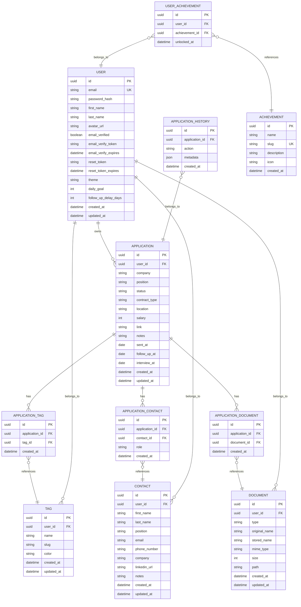
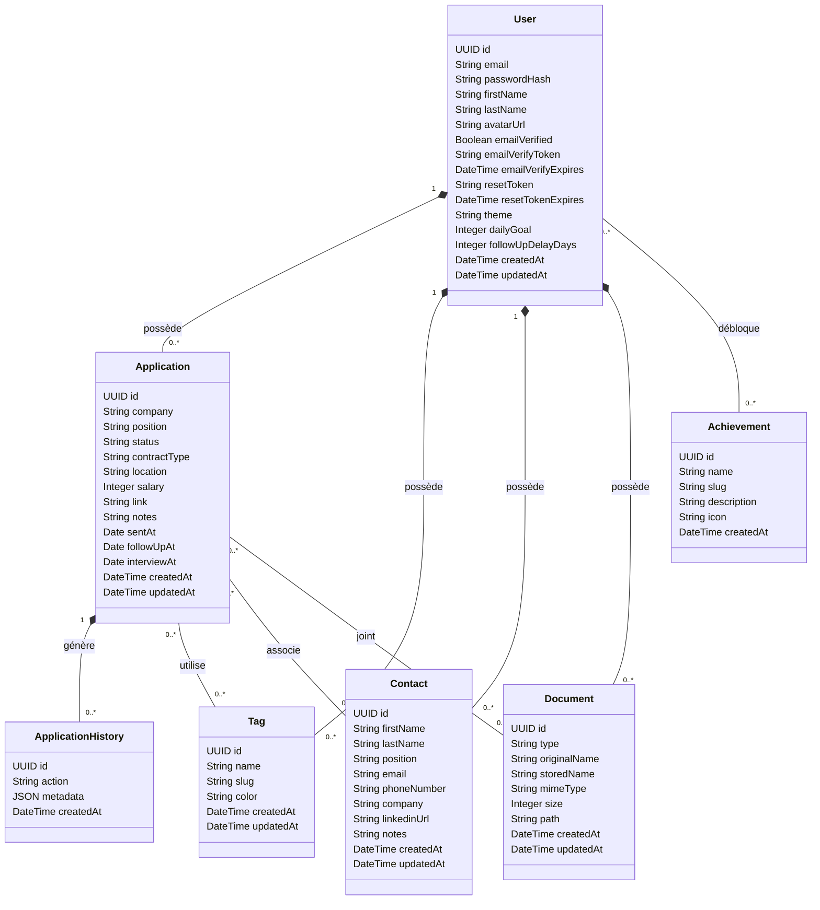
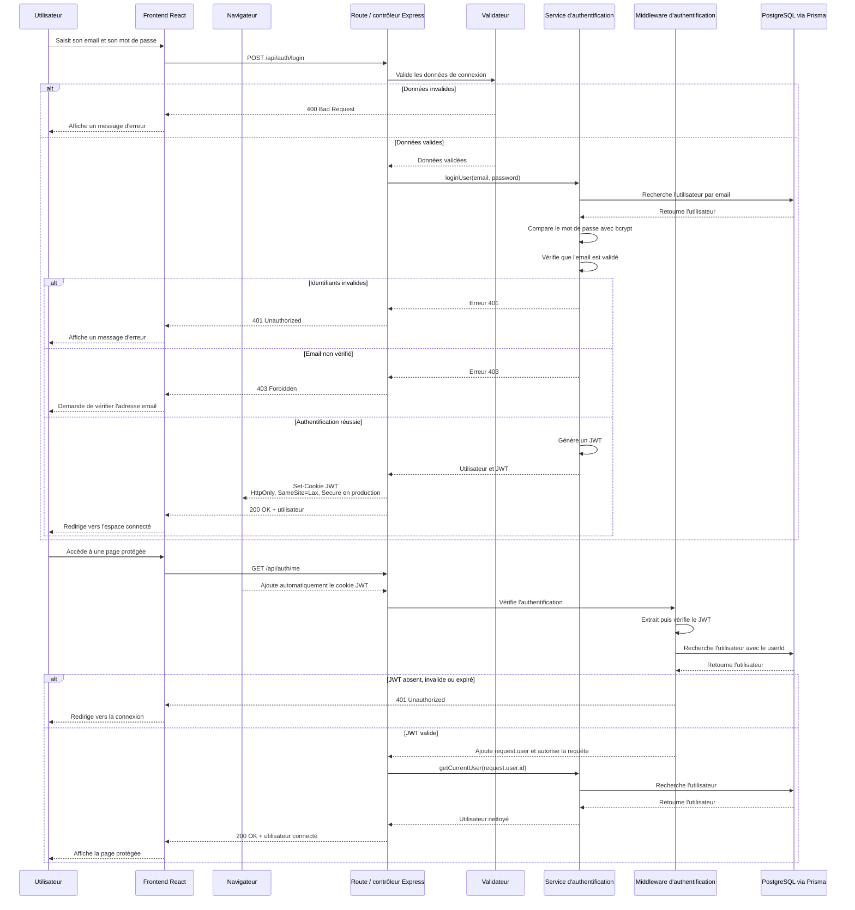
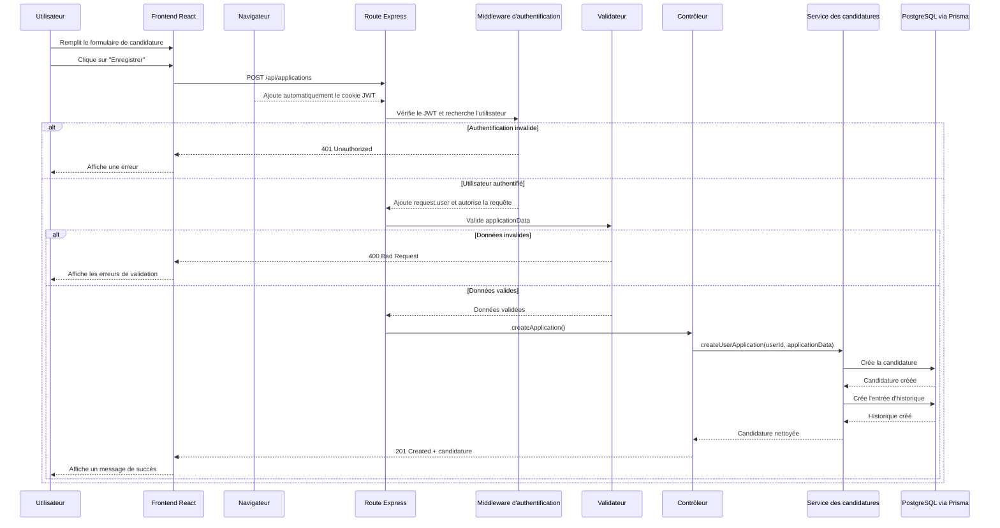
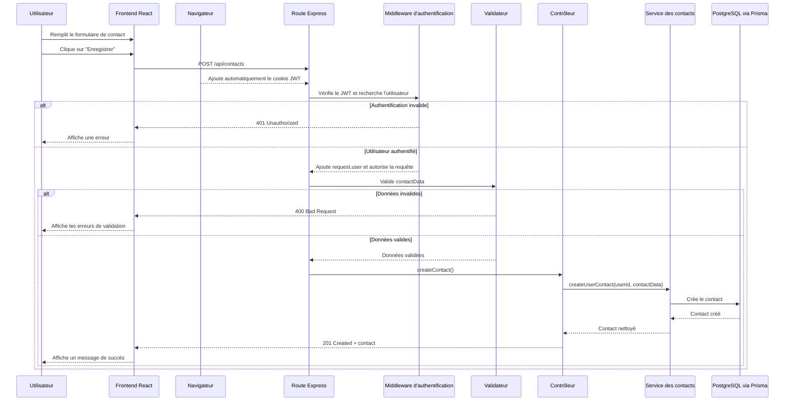
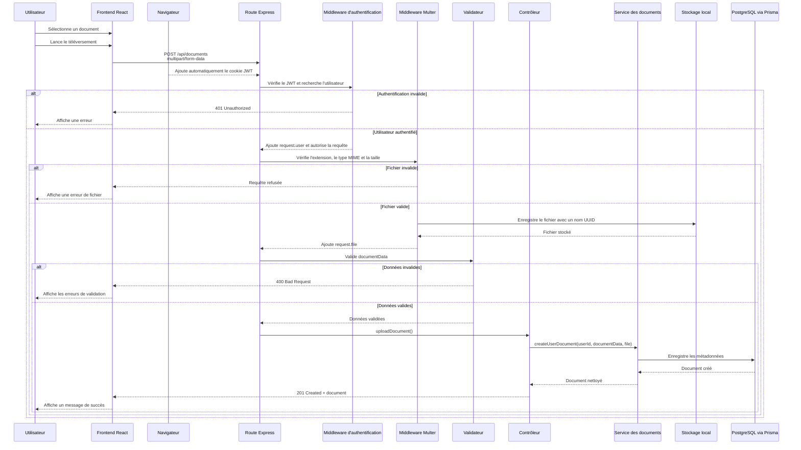
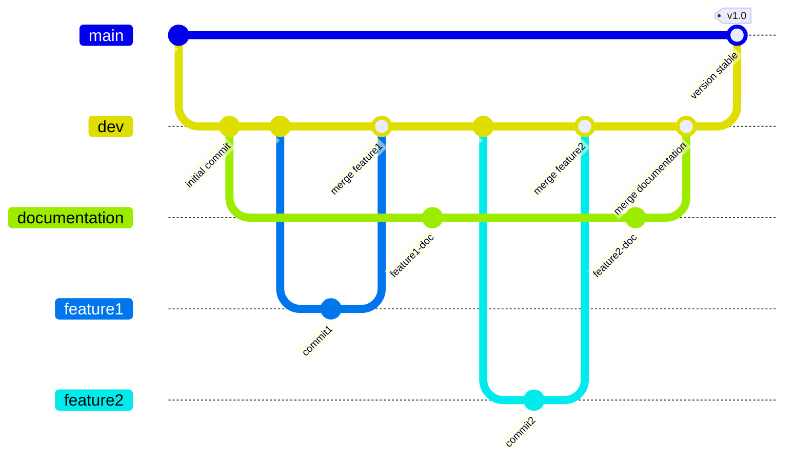

# Diagrammes Mermaid

## 1. Diagramme entité-association

## 2. Diagramme de classes métier simplifié

## 3. Diagramme de séquence : authentification

## 4. Diagramme de séquence : création d’une candidature

## 5. Diagramme de séquence : création d’un contact

## 6. Diagramme de séquence : téléversement d’un document

## 7. Workflow Git simplifié

## 8. Historique Git simplifié : backend

```mermaid
gitGraph
    commit id: " "

    branch dev
    checkout dev
    commit id: "  "

    branch documentation
    checkout documentation
    commit id: "docs: create documentation branch"

    checkout dev
    commit id: "   "

    branch project-foundation
    checkout project-foundation
    commit id: "chore: initialize project structure"

    checkout dev
    merge project-foundation

    commit id: "    "

    branch backend-foundation
    checkout backend-foundation
    commit id: "feat: initialize backend package"
    commit id: "feat: setup express application"
    commit id: "feat: add health check endpoint"
    commit id: "feat: add basic error handling"
    commit id: "chore: add backend environment configuration"
    commit id: "chore: add backend docker service"
    commit id: "chore: add postgres docker service"
    commit id: "feat: add database health endpoint"
    commit id: "chore: install prisma"
    commit id: "feat: add initial prisma schema"
    commit id: "feat: add initial database migration"
    commit id: "chore: add prisma client configuration"
    commit id: "refactor: use prisma for database health endpoint"
    commit id: "fix: remove unused database configuration"

    checkout dev
    merge backend-foundation

    checkout documentation
    commit id: "docs: add backend manual validation guide"

    checkout dev
    commit id: "     "

    branch backend-auth
    checkout backend-auth
    commit id: "chore: configure backend eslint"
    commit id: "feat: add authentication route structure"
    commit id: "feat: add user registration"
    commit id: "feat: add email verification flow"
    commit id: "feat: add user login"
    commit id: "feat: add authentication middleware"
    commit id: "feat: add current user endpoint"
    commit id: "feat: add profile endpoints"
    commit id: "feat: add user settings endpoints"
    commit id: "feat: add password update endpoint"
    commit id: "feat: add password reset flow"
    commit id: "feat: add user data export endpoint"
    commit id: "feat: add account deletion endpoint"
    commit id: "fix: normalize authentication error responses"
    commit id: "feat: add email service configuration"
    commit id: "feat: send email verification email"
    commit id: "feat: send password reset email"
    commit id: "fix: remove development auth tokens from responses"

    checkout dev
    merge backend-auth

    checkout documentation
    commit id: "docs: add authentication manual validation"

    checkout dev
    commit id: "      "

    branch backend-applications
    checkout backend-applications
    commit id: "feat: add contacts crud"
    commit id: "feat: add applications crud"
    commit id: "feat: link contacts to applications"
    commit id: "feat: add tags crud"
    commit id: "feat: link tags to applications"
    commit id: "feat: add application history endpoint"

    checkout dev
    merge backend-applications

    checkout documentation
    commit id: "docs: add applications manual validation"

    checkout dev
    commit id: "       "

    branch backend-documents
    checkout backend-documents
    commit id: "feat: add document upload configuration"
    commit id: "feat: add documents crud"
    commit id: "feat: link documents to applications"

    checkout dev
    merge backend-documents

    checkout documentation
    commit id: "docs: add documents manual validation"

    checkout dev
    commit id: "        "

    branch backend-achievements
    checkout backend-achievements
    commit id: "feat: add achievements Prisma schema"
    commit id: "feat: add achievements catalog endpoint"
    commit id: "feat: unlock achievements from user actions"

    checkout dev
    merge backend-achievements

    checkout documentation
    commit id: "docs: add achievements manual validation"

    checkout dev
    commit id: "         "

    branch backend-cleanup
    checkout backend-cleanup
    commit id: "refactor: standardize contact validation and route order"
    commit id: "refactor: use english application values"
    commit id: "refactor: harmonize application routes and controller order"
    commit id: "refactor: harmonize application service structure"
    commit id: "refactor: harmonize supporting service structure"
    commit id: "refactor: harmonize supporting routes structure"
    commit id: "refactor: harmonize supporting validators structure"

    checkout dev
    merge backend-cleanup

    checkout documentation
    commit id: "docs: rewrite backend manual validation"

    checkout dev
    commit id: "          "

    branch backend-tests
    checkout backend-tests
    commit id: "test: cover health route"
    commit id: "test: cover error handling route"
    commit id: "test: cover error routes"
    commit id: "test: cover authentication routes"
    commit id: "test: cover applications routes"
    commit id: "test: standardize test descriptions"
    commit id: "test: cover profile routes"
    commit id: "test: cover tags routes"
    commit id: "test: cover contacts routes"
    commit id: "test: cover documents routes"
    commit id: "test: cover relation routes"
    commit id: "test: cover achievements routes"

    checkout dev
    merge backend-tests

    checkout documentation
    commit id: "docs: add automated backend tests summary"
    commit id: "docs: add swagger api documentation"

    checkout dev
    commit id: "           "

    branch update_contact_details
    checkout update_contact_details
    commit id: "feat: add contact professional fields to schema"
    commit id: "feat: support contact professional details"

    checkout dev
    merge update_contact_details

    commit id: "            "

    branch auth_cookies
    checkout auth_cookies
    commit id: "chore: add authentication cookie configuration"
    commit id: "feat: store authentication token in secure cookie"
    commit id: "feat: add authentication logout endpoint"
    commit id: "test: upgrade cookie tests and preserve development data"

    checkout dev
    merge auth_cookies

    checkout documentation
    commit id: "docs: update contact manual validation"
    commit id: "docs: update contact automated tests"
    commit id: "docs: update contact API documentation"

    checkout dev
    merge documentation
```

## 9. Historique Git simplifié : frontend

```mermaid
gitGraph
    commit id: " "

    branch dev
    checkout dev
    commit id: "  "

    branch documentation

    checkout dev
    commit id: "   "

    branch frontend-foundation
    checkout frontend-foundation
    commit id: "feat: initialize frontend application"
    commit id: "feat: add frontend base routing"
    commit id: "feat: add frontend api client foundation"

    checkout dev
    merge frontend-foundation

    commit id: "    "

    branch frontend-auth
    checkout frontend-auth
    commit id: "feat: add authentication api methods"
    commit id: "feat: add authentication context"
    commit id: "feat: add authentication forms"
    commit id: "feat: protect frontend routes"
    commit id: "feat: add frontend email verification flow"
    commit id: "feat: add frontend password reset flow"

    checkout dev
    merge frontend-auth

    commit id: "     "

    branch frontend-layout
    checkout frontend-layout
    commit id: "feat: add application header"
    commit id: "feat: add dashboard sidebar"
    commit id: "feat: add dashboard navigation pages"

    checkout dev
    merge frontend-layout

    commit id: "      "

    branch frontend-settings
    checkout frontend-settings
    commit id: "feat: add settings api calls"
    commit id: "feat: build user settings page"
    commit id: "feat: add legal account settings"
    commit id: "feat: add theme management"
    commit id: "feat: complete user settings experience"

    checkout dev
    merge frontend-settings

    commit id: "       "

    branch frontend-applications
    checkout frontend-applications
    commit id: "feat: add applications api client"
    commit id: "feat: add application creation modal"
    commit id: "refactor: split application modal components"
    commit id: "feat: add application details management"
    commit id: "feat: add applications table"
    commit id: "feat: add applications table controls"
    commit id: "feat: improve application date rules"

    checkout dev
    merge frontend-applications

    commit id: "        "

    branch frontend-contacts
    checkout frontend-contacts
    commit id: "feat: add contacts page"
    commit id: "feat: add contact cards and modal"

    checkout dev
    merge frontend-contacts

    commit id: "         "

    branch frontend-documents
    checkout frontend-documents
    commit id: "feat: add document upload modal"
    commit id: "feat: add document preview modal"
    commit id: "feat: add document cards with previews"
    commit id: "feat: build documents page"
    commit id: "fix: remove control regex from document names"
    commit id: "fix: polish document previews"

    checkout dev
    merge frontend-documents

    commit id: "          "

    branch frontend-componentization
    checkout frontend-componentization
    commit id: "chore: prepare frontend component structure"
    commit id: "refactor: restructure dashboard sidebar"
    commit id: "refactor: extract application select options"
    commit id: "refactor: reuse application options in details modal"
    commit id: "refactor: reuse application options in table"
    commit id: "refactor: extract application display helpers"
    commit id: "refactor: extract application form constants"
    commit id: "refactor: extract API response helpers"
    commit id: "refactor: extract string normalization helper"
    commit id: "refactor: extract application date helpers"
    commit id: "refactor: extract application relation helpers"
    commit id: "refactor: extract application label helpers"
    commit id: "refactor: organize application form sections"
    commit id: "refactor: simplify application creation modal"
    commit id: "refactor: share contact form fields"
    commit id: "refactor: share document upload fields"
    commit id: "refactor: simplify application details modal"
    commit id: "refactor: simplify applications table"
    commit id: "refactor: extract document helpers"
    commit id: "refactor: clean frontend organization"

    checkout dev
    merge frontend-componentization

    commit id: "           "

    branch frontend-calendar
    checkout frontend-calendar
    commit id: "feat: add calendar event utilities"
    commit id: "feat: add desktop applications calendar"
    commit id: "feat: add mobile calendar agenda view"

    checkout dev
    merge frontend-calendar

    commit id: "            "

    branch frontend-achievements
    checkout frontend-achievements
    commit id: "feat: add achievements objective page"

    checkout dev
    merge frontend-achievements

    commit id: "             "

    branch frontend-statistics
    checkout frontend-statistics
    commit id: "feat: add applications statistics page"
    commit id: "feat: add applications location map"
    commit id: "fix: improve monthly activity chart responsiveness"

    checkout dev
    merge frontend-statistics

    commit id: "              "

    branch frontend-dashboard
    checkout frontend-dashboard
    commit id: "feat: add dashboard overview page"

    checkout dev
    merge frontend-dashboard

    commit id: "               "

    branch frontend-ui_harmonization
    checkout frontend-ui_harmonization
    commit id: "refactor: normalize frontend ui baseline"
    commit id: "refactor: harmonize frontend navigation styles"
    commit id: "refactor: harmonize dashboard page headers"
    commit id: "refactor: simplify dashboard card styles"
    commit id: "refactor: add shared card components"
    commit id: "refactor: polish dashboard overview"

    checkout dev
    merge frontend-ui_harmonization
```

