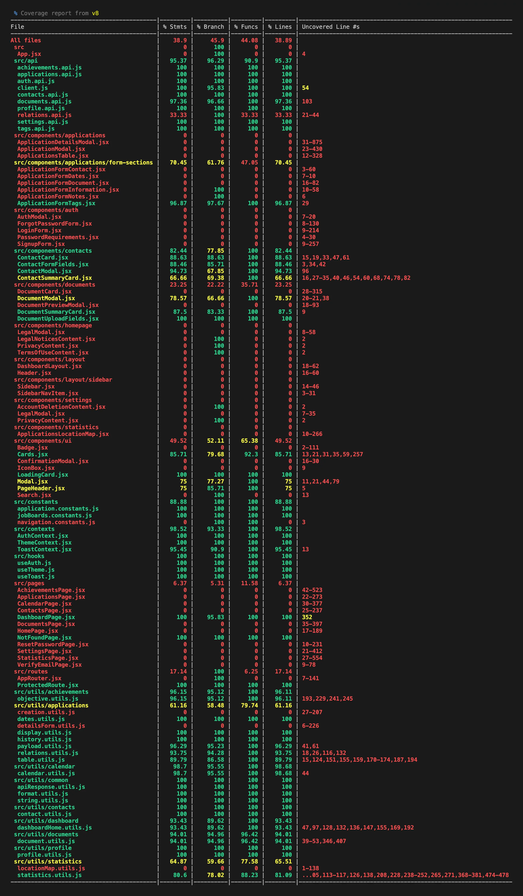

# JobTrace - Frontend

## Description

The JobTrace frontend is a responsive single-page application that provides the user interface for managing and monitoring job applications.

Built with Vite and React, it communicates with the JobTrace REST API to display and manage applications, contacts, documents, achievements, statistics and user preferences.

The interface is designed with Tailwind CSS and DaisyUI and supports light and dark themes. It also includes authentication flows, protected routes, responsive layouts, interactive notifications and automated component tests.

## Objectives

- Provide a clear and responsive interface for the JobTrace application.
- Allow users to manage applications, contacts and documents.
- Display interviews, follow-ups and personal objectives.
- Present application statistics through an interactive dashboard.
- Provide secure authentication and protected user routes.
- Support light and dark themes.
- Maintain code quality through linting and automated tests.
- Ensure a consistent experience across desktop, tablet and mobile devices.

## Tech Stack


## File Description

| **FILE**            | **DESCRIPTION**                                                                      |
| :-----------------: | ------------------------------------------------------------------------------------ |
| `assets/`           | Contains the resources required for the repository.                                  |
| `public/`           | Contains the public resources required for the repository.                           |
| `src/`              | Contains the source code of the React application.                                   |
| `tests/`            | Contains the frontend automated tests and their supporting utilities.                |
| `.env.example`      | Provides an example of the environment variables required to configure the frontend. |
| `index.html`        | Defines the main HTML entry point and the application metadata.                      |
| `package.json`      | Defines the project metadata, dependencies and available npm scripts.                |
| `package-lock.json` | Locks the exact versions of the installed npm dependencies.                          |
| `eslint.config.js`  | Linter configuration to enforce code quality.                                        |
| `vite.config.js`    | Configures Vite, Tailwind CSS, the development server and the testing environment.   |
| `nginx.conf`        | Configures Nginx to serve the production build and proxy API requests.               |
| `Dockerfile`        | Defines the Docker image used to build and serve the frontend application.           |
| `.dockerignore`     | Specifies files and folders to be ignored by Docker.                                 |
| `README.md`         | The README file you are currently reading 😉.                                        |

## Installation & Usage

### Installation

1. Clone this repository:
    - Open your preferred Terminal.
    - Navigate to the directory where you want to clone the repository.
    - Run the following command:

```
git clone https://github.com/fchavonet/full_stack-jobtrace.git
```

2. Open the cloned repository.

3. Open the frontend directory:

```
cd frontend
```

4. Install the dependencies:

```
npm install
```

5. Create the local environment file:

```
cp .env.example .env
```

6. Configure the required environment variables inside the `.env` file.

7. Open a second Terminal, navigate to the root directory of the project, and start the PostgreSQL database:

```
docker compose up database -d
```

8. Return to the first Terminal, which should still be located in the `frontend/` directory, and start the frontend development server:

```
npm run dev
```

### Usage

1. Once the frontend development server is running, open your browser and navigate to:

```
http://localhost:3000
```

2. To run the automated tests:

```
npm test
```

3. Additional useful commands:

- Generate a production build: `npm run build`.
- Preview the production build locally: `npm run preview`.

<br>

- Run ESLint: `npm run lint`.
- Automatically fix supported linting issues: `npm run fix`.

<br>

- Run the test suite with detailed output: `npm run test:verbose`.
- Generate the test coverage report: `npm run test:coverage`.

4. The following screenshot shows the generated frontend code coverage report.



> For a clearer and more detailed overview of the automated test suite, covered features and latest results, refer to [the frontend automated test summary](./docs/automated-tests.md).

You can also test the project online by clicking [here](https://www.jobtrace.fr/).

<p align="center">
    <picture>
        <source media="(prefers-color-scheme: light)" srcset="../assets/images/screenshots/dashboard-light.webp">
        <source media="(prefers-color-scheme: dark)" srcset="../assets/images/screenshots/dashboard-dark.webp">
        
    </picture>
</p>

<p align="center">
    <picture>
        <source media="(prefers-color-scheme: light)" srcset="../assets/images/screenshots/applications-light.webp">
        <source media="(prefers-color-scheme: dark)" srcset="../assets/images/screenshots/applications-dark.webp">
        
    </picture>
</p>

<p align="center">
    <picture>
        <source media="(prefers-color-scheme: light)" srcset="../assets/images/screenshots/application_form-light.webp">
        <source media="(prefers-color-scheme: dark)" srcset="../assets/images/screenshots/application_form-dark.webp">
        
    </picture>
</p>

<p align="center">
    <picture>
        <source media="(prefers-color-scheme: light)" srcset="../assets/images/screenshots/calendar-light.webp">
        <source media="(prefers-color-scheme: dark)" srcset="../assets/images/screenshots/calendar-dark.webp">
        
    </picture>
</p>

<p align="center">
    <picture>
        <source media="(prefers-color-scheme: light)" srcset="../assets/images/screenshots/achievements-light.webp">
        <source media="(prefers-color-scheme: dark)" srcset="../assets/images/screenshots/achievements-dark.webp">
        
    </picture>
</p>

<p align="center">
    <picture>
        <source media="(prefers-color-scheme: light)" srcset="../assets/images/screenshots/contacts-light.webp">
        <source media="(prefers-color-scheme: dark)" srcset="../assets/images/screenshots/contacts-dark.webp">
        
    </picture>
</p>

<p align="center">
    <picture>
        <source media="(prefers-color-scheme: light)" srcset="../assets/images/screenshots/documents-light.webp">
        <source media="(prefers-color-scheme: dark)" srcset="../assets/images/screenshots/documents-dark.webp">
        
    </picture>
</p>

<p align="center">
    <picture>
        <source media="(prefers-color-scheme: light)" srcset="../assets/images/screenshots/statistics-light.webp">
        <source media="(prefers-color-scheme: dark)" srcset="../assets/images/screenshots/statistics-dark.webp">
        
    </picture>
</p>

<p align="center">
    <picture>
        <source media="(prefers-color-scheme: light)" srcset="../assets/images/screenshots/settings-light.webp">
        <source media="(prefers-color-scheme: dark)" srcset="../assets/images/screenshots/settings-dark.webp">
        
    </picture>
</p>

<table align="center">
    <tr>
        <th align="center" style="text-align: center;">Desktop view</th>
        <th align="center" style="text-align: center;">Tablet view</th>
        <th align="center" style="text-align: center;">Mobile view</th>
    </tr>
    <tr valign="top">
        <td align="center">
            <picture>
                <source media="(prefers-color-scheme: light)" srcset="../assets/images/screenshots/homepage-desktop-light.webp">
                <source media="(prefers-color-scheme: dark)" srcset="../assets/images/screenshots/homepage-desktop-dark.webp">
                
            </picture>
        </td>
        <td align="center">
            <picture>
                <source media="(prefers-color-scheme: light)" srcset="../assets/images/screenshots/homepage-tablet-light.webp">
                <source media="(prefers-color-scheme: dark)" srcset="../assets/images/screenshots/homepage-tablet-dark.webp">
                
            </picture>
        </td>
        <td align="center">
            <picture>
                <source media="(prefers-color-scheme: light)" srcset="../assets/images/screenshots/homepage-mobile-light.webp">
                <source media="(prefers-color-scheme: dark)" srcset="../assets/images/screenshots/homepage-mobile-dark.webp">
                
            </picture>
        </td>
    </tr>
</table>

## What's Next?

- Improve the user interface and overall user experience.
- Continue improving accessibility across the application.
- Add city autocomplete using an external API.
- Improve application performance and loading times.
- Continue expanding automated test coverage.
- Complete the CI/CD pipeline with automated deployment to the VPS.

## Thanks

- I would like to thank all those who participated or helped to carry out this project.
- A big thank you to my friends Pierre and Yoann, always available to test and provide feedback on my projects.

## Author(s)

**Fabien CHAVONET**
- GitHub: [@fchavonet](https://github.com/fchavonet)
- LinkedIn: [Fabien Chavonet](https://www.linkedin.com/in/fchavonet/)
